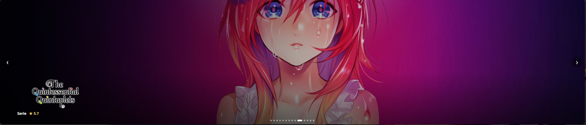

# PunisherBanna

PunisherBanna adds a customizable banner carousel with random movies or TV shows to the Jellyfin home screen.

## Preview



## Features

- Show random movies or TV shows from a selected library
- Customize the number, size, and automatic rotation of banners
- Optionally show complete images and videos inside a large banner with softly blurred artwork filling unused space
- Optionally center the banner at a custom width from 45 to 100 percent, with a live settings preview and responsive logo placement
- Optionally show ratings and navigation controls
- Optionally replace the active banner image with a muted local trailer or a short server-hosted movie/episode preview
- Automatically prefer a local trailer, then a media preview, and always retain the original image as a fallback
- Configure the video delay, clip length, start position, quality, end behavior, and optional mobile playback
- Optionally allow a per-user mute button whose state is retained across refreshes for that Jellyfin server and user
- Set the administrator-controlled banner audio volume from 0 to 100 percent (20 percent by default)
- Navigate by touch, mouse, or keyboard
- Open the Jellyfin details page directly from a banner

Banner videos use only media available through the user's own Jellyfin server. External trailer services are not embedded. Reduced-motion mode, data-saving mode, leaving the banner, and starting Jellyfin's regular player stop preview playback and keep the normal banner image visible.

## Requirements

- Jellyfin Server 12.1.x
- [File Transformation 3.0.0.0](https://github.com/IAmParadox27/jellyfin-plugin-file-transformation/releases/tag/3.0.0.0)

## Installation

Add the following repository URL under **Dashboard → Plugins → Repositories**:

```text
https://raw.githubusercontent.com/PunikaSama/PunisherBanna/main/manifest.json
```

Install PunisherBanna, select a library in the plugin settings, and then restart Jellyfin completely.

When upgrading from an older PunisherBanna build, install version `2.0.0.0` or newer and select the library again. Jellyfin may otherwise keep loading an older, higher-numbered `1.x` build.

## License

PunisherBanna is licensed under the MIT License. Copyright © 2026 PunisherSama.

## Clients

The plugin works in the Jellyfin web client and in applications that embed the web client. Fully native client interfaces are not modified.
